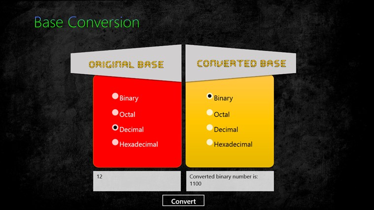

!SLIDE center
# INFINITY #

!SLIDE commandline incremental
# Infinity in Ruby ?? 

    $ irb> 1.0/0.0
    => Infinity

    $ irb> inf = 1/0.0
    => Infinity 

!SLIDE commandline incremental
# Infinity in Ruby ??  #

    $ irb> inf.class
    => Float

    $ irb> Float::INFINITY
    => Infinity 

    $ 3 > Float::INFINITY 
    => false 

!SLIDE commandline incremental
# Infinity as a range object? #

    $ irb>  inf=1.0/0.0
     => Infinity 

    $ irb>  (1..inf).include?(100000000000000)
    => true 

    $ irb> (-inf..inf).include?(-100000000000000)
    => true 

!SLIDE commandline incremental 
# Catches #

    $ irb> 1/0
    => ZeroDivisionError: divided by 0

    $ irb> 1.0/0 == 1/0.0  
    => true 

!SLIDE center  
# Base Jumping

!SLIDE center  

!SLIDE commandline incremental
# to_s with base

    @@@ ruby
    $ irb> 12345.to_s(2)
    => "11000000111001"  # => Binary

    $ irb> 12345.to_s(8)
    => "30071"           # => Octal

    $ irb> 12345.to_s(16)
    => "3039"            # => Hexadecimal

!SLIDE commandline incremental
# to_s with base

    $ irb> 12345.to_s(12)
    => "7189" 

    $ irb> 12345.to_s(36)
    => "9ix"      # That is an actual number
 
!SLIDE incremental
# Really Know to_i ? #

* Operates on strings to convert to fixnum
* Default base 10
* Can be used for other bases upto 36 

!SLIDE commandline incremental
# to_i Examples #

    @@@ ruby
    $ irb> "ab".to_i(12)
    => 131 

    $ irb>"1010101".to_i(2)
    => 85 

    $ irb>"ff".to_i(16)
    => 255 

    $ irb> "9ix".to_i(36)
    => 12345 

!SLIDE commandline incremental

# Catches #
   
    @@@ ruby
    $ irb> "c123".to_i(12)
    => 0 

    $ irb> "abc123".to_i(12)
    => 131 

