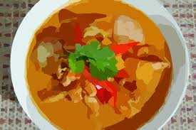

!SLIDE incremental
# Ah! Case statements

!SLIDE incremental
# Proc in case statement??

    @@@ruby
    def multiple_of(factor)
      Proc.new {|p| p.modulo(factor).zero?}
    end

    number = 9
    case number
      when multiple_of(3)
        puts "Multiple of 3"
      when multiple_of(7)
        puts "Multiple of 7"
    end

!SLIDE
# Behind every case is a ===

    @@@ruby
    number = 9
    case number 
      when multiple_of(3)

**is equivalent to**

    @@@ruby
    Proc.new {|p| p.modulo(3).zero?} === 9

!SLIDE
# And ...

##Proc#=== is an alias to Proc#call. So,
    
    @@@ruby
    Proc.new {|p| p.modulo(3).zero?} === 9

**is equivalent to**

    @@@ruby
    Proc.new {|p| p.modulo(3).zero?}.call(9)

##and the block returns the value of the last evaluted expression

!SLIDE center 

##Any class can override the === method 
##and therefore define it’s behavior for usage 
##in a case statement

!SLIDE center incremental
#Presenting Curry#

!SLIDE incremental
# The Proc#curry #

    @@@ ruby
    day=lambda{|day, date| date.wday == day}

    it_is_saturday = day.curry[6]
    it_is_sunday = day.curry[0]

    case Time.now
        when it_is_saturday
            puts "Saturday!"
        when it_is_sunday
            puts "Sunday!"
        else
            puts "Not the weekend"
    end

!SLIDE bullets incremental
# Whats the recipe?

* A curried proc receives some arguments. 
* If sufficient number of arguments are supplied, it passes the supplied arguments to the original proc and returns the result. 
* Otherwise, returns another curried proc that takes the rest of arguments.

!SLIDE
# Proc#curry at its best
## Proc#curry allows you to turn a Proc accepting n arguments into one that accepts < n

